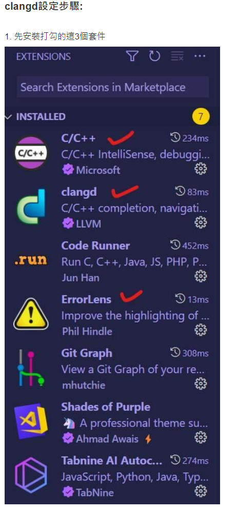

# C_and_Cpp_Environment_Setup

## Clangd 讚讚讚

__如何在VSCode上搞出一個好的 C/C++ 開發環境?__

__設定步驟實際順序是: 2 3 4 5 6 8 1 7 9__

* 先裝這些再弄VSCode的設置會比較好，先裝VSCode裡面的 clangd 套件他有可能自己抓clangd執行檔，這樣會出問題! 

* 如果先跑去抓vscode上面的套件，他會問你要不要幫你抓clangd，如果沒看清楚直接點"要"的話，那就完蛋BBQ了
* 打的原文部份我懶得在重新截圖了~
 
 

